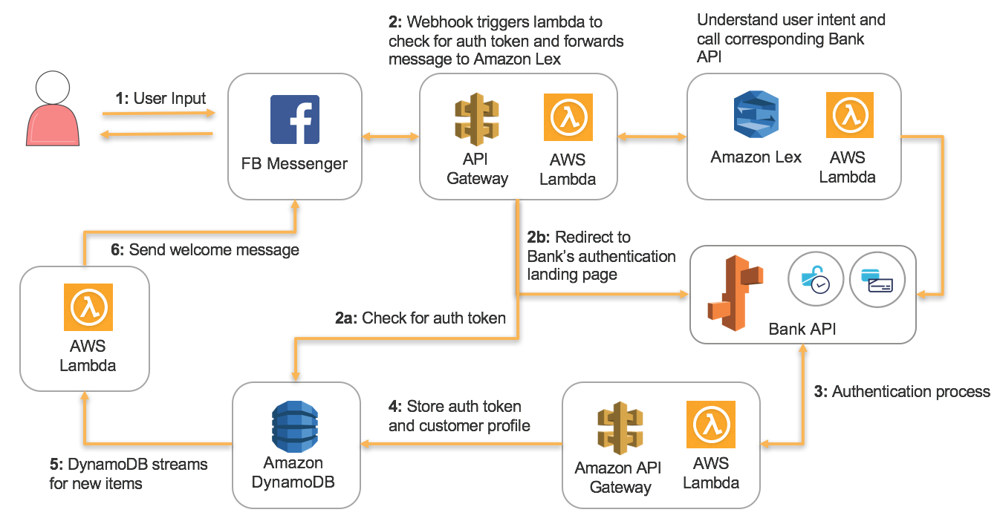

# Banking ChatBot with Facebook Messenger 

## Overview
This repo demonstrates how you can easily build a ChatBot that interacts with Facebook Messenger
to perform simple banking instructions, using AWS services.

## Setup Environment

To get started, you need to create a Facebook page account, a Lex bot and launch a CloudFormation
template, which will connect everything together.

### Step 1 - Creating Facebook Page
First we will need to create a new Page on Facebook, create a Facebook App through Facebook's
developer portal. A Facebook Page ID and Access Token will be created at this stage, which are
required later when creating the CloudFormation stack.

1. Open your Facebook account and navigate to Facebook Pages and [**Create a
   Page**](https://www.facebook.com/pages/create).
2. Choose the type of Page you want to create. For this demo, we will choose a **Cause or
   Community** page and provide it a name, such as for example _Your Name_ Bank.
3. Proceed to setup the Facebook Page. These steps are optional, and you can safely hit the **Skip**
   button until the Facebook page is created.
4. Once the page is created, navigate to **About** section and find **Page ID** at the bottom. Save
   this number for later use.
5. Navigate to the [Facebook Developer Portal](https://developers.facebook.com/) and click on the
   right-hand drop-down box **My Apps** and select **Add a New App**
   
6. Provide your application a name and provide a working e-mail address.
7. Facebook will now redirect you to your App Settings page. Choose **Messenger** and click
   **Setup**
   
8. In the Messenger Settings page, scroll down to the section **Token Generation**. Choose the page
   that you created just now and a **Page Access Token** will be generated. Save this token for
   later use.

### Step 2 - Creating the stack
Launch the CloudFormation stack by clicking on **Deploy to AWS** below.

You will be prompted to input some parameters. Use the Page ID and Access Token you received from
Step 1. At this point, you will need to give your Lex bot a name and alias, such as **BankBot** and
**Demo**. Since Lex is not yet supported by CloudFormation, we will be creating the Lex bot manually
at the next step.

Once the stack creation has completed, an URL will be shown in the Outputs. This URL will be used in
Step 4 for Facebook integration.

### Step 3 - Create a Lex bot
Here in this step, we will create a Lex bot. Since CloudFormation does not support Lex currently, we
have to do this step manually. We will be using region **us-east-1** for this setup.

**Create the Bot**

1. Navigate to [AWS console for Lex](https://console.aws.amazon.com/lex/home?region=us-east-1#)
2. Create a bot and select **Custom bot**
3. Give you bot a name, for example _BankBot_, you will need this name later in Step 3
4. For output voice, select **None**
5. Set **5** minute for session timeout
6. Choose **No** for COPPA.
7. Click **Create** to create the bot

**Add Intents to bot**

After the bot is created, we need to add Intents to the bot. For this setup, we will be creating two
intents, one for retrieving account summary and another for money movement.

1. Click **Create Intent** 
2. For the first intent, we will call it **ShowAccounts**. Type this in the name field and click
   **Add**
3. Add a few sample utterances like the following:
   
4. For the ShowAccounts intent, we will have one slot for the account group type. Create a new slot
   type by clicking the **+** sign beside **Slot types** on the left navigation menu.
5. Type **AccountGroup** for name, give it a description, and choose **Expand Values** for
   resolution.
6. Next, add a new slot to the intent using our new AccountGroup type.
   
7. Integrate with our lambda function for validation. There is a Lambda function **bank-bot-demo**
   which was already created by CloudFormation.

   
8. Choose the same Lambda function for fultillment and **Save Intent**
   
9. Similarly, setup the second intent for money movement. We will call this intent **MoneyMovement**
   

### Step 4 - Facebook Page Integration

The last step here is to link Facebook Messenger with our chat bot API. Facebook Messenger uses
webhooks for such kind of integration. 

1. Back in our Facebook Messenger settings, under the **Webhooks** section, click **Setup Webhooks**
   
2. In the popup dialog enter the URL provided in CloudFormation outputs into the **Callback URL**
   textbox. For the **Verify token** value, enter **bank-bot-demo**. For the **Subscription fields**
   tick the **messages** checkbox, this will allow us to be notified via webhook upon any new
   message.
   
3. Lastly, subscribe the Page that was created earlier to this webhook.
   

### Step 5 - Test out your chat bot

Now your chat bot is successfully setup. It's time to test it out. Navigate back to the Facebook
Page and try sending messages. Enjoy playing with your chat bot!

